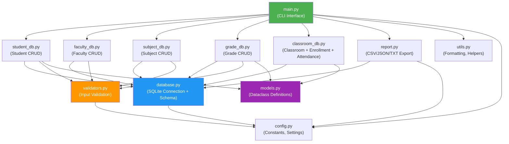

# SƠ ĐỒ MODULE VÀ LUỒNG DỮ LIỆU CHÍNH
*(Sản phẩm nộp Lab 2A)*

### Giải thích luồng dữ liệu chính:
1. **Tiếp nhận:** Người dùng nhập lệnh thông qua giao diện dòng lệnh tại `main.py`.
2. **Điều phối:** CLI gọi đến các phương thức tương ứng trong các module Business Logic (`student_db.py`, `faculty_db.py`, v.v.).
3. **Xác thực (Validation):** Trước khi thao tác với cơ sở dữ liệu, dữ liệu đầu vào được kiểm tra tính hợp lệ thông qua module `validators.py`.
4. **Thao tác CSDL:** Các module logic sử dụng `database.py` để thực thi câu lệnh SQL (INSERT, SELECT, UPDATE, DELETE).
5. **Đóng gói dữ liệu:** Kết quả trả về từ CSDL (dạng SQLite Row) được map thành các Object/Dataclass định nghĩa trong `models.py`.
6. **Trả kết quả:** CLI nhận các Object này, sử dụng `utils.py` để format (tạo bảng, làm tròn số) và hiển thị ra màn hình cho người dùng.
